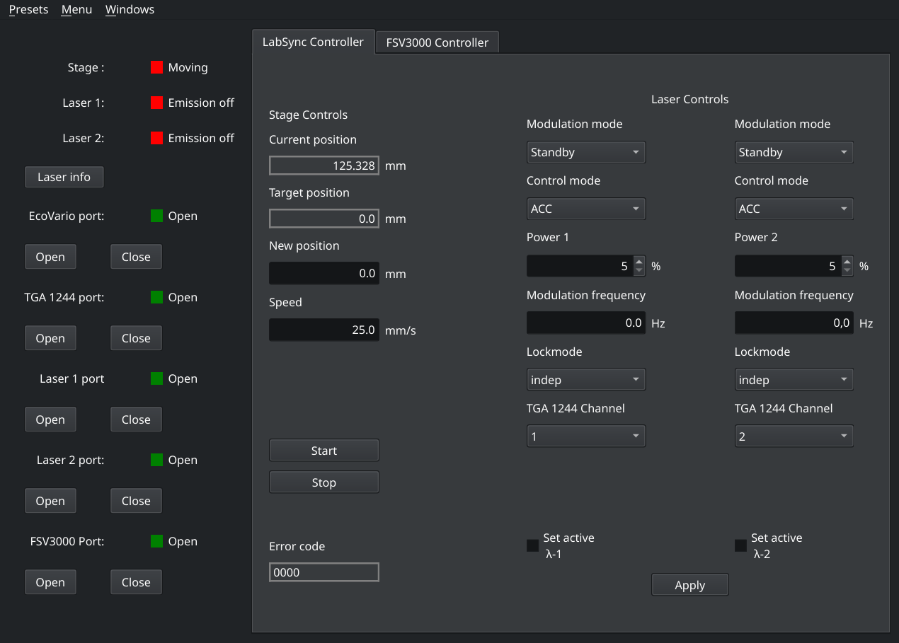

# LabSync

A cross-platform PySide6 application that manages laboratory equipment.


## Overview

LabSync centralizes the management of different Lab devices to reduce complexity.
This provides a more simple and intuitive interface for controlling different devices simultaneously.

LabSync allows for the following features:

* **Unified Control** - Single interface for multiple devices
* **Multi-Device support** - Compatible with various instrument types
* **Real-Time Data Acquisition** - Live data streaming and visualization
* **Preset Saving/Loading** - Save device parameters and load them again

For this the following device backends are included:

* **JAT EcoVario 114D** - Linear Stage (primarily motor decoder) 
* **Omicron LuxX+** - Laser
* **TTi Instruments TGA1244** - 4 Channel Frequencygenerator (RS232 Backend) 
* **Rhode & Schwarz FSV3000** - Spectrum-Analyzer (TCPIP Backend)

## Quick Start

### Prerequisites

To run the following needs to be installed:

* Python 3.13 (Recommended) or lower 
* pip (Python Package installer)

(Python 3.13 is the latest version compatible with PySide6)

### 1. Install
```bash
# Clone the repository (Recommended)
git clone https://github.com/BeaNotedttlz/LabSync.git
# Otherwise download 'LabSync.zip' from releases

# Install required Python packages
cd LabSync
pip install -r requirements.txt
```

### 2. Run based on your OS:
```bash
# Windows:
python LabSync-Win.pyw
# Note that double click also works

# Unix:
./LabSync-Unix
# Or run to enable double click to launch:
chmod +x LabSync-Unix  
```
### Virtual environment (Optional but Recommended)
```bash
python -m venv venv

# Windows:
venv\Scripts\activate

# Unix:
source venv/bin/activate

cd LabSync
pip install -r requirements.txt
```

## General Usage

### 1. First Startup

When first starting LabSync you get the following Window (Linux):



This window provides

* Information Panel (Left side)
  * Port status / Open & Close Ports
  * Laser information pop-up window with crucial information
  * Laser emission and Stage positioning status
* Standard Stage controls
  * View current position and Target position
  * Set new position (Write to Target Press: <kbd>Enter</kbd>)
  * Set new Stage speed
  * Start / Stop Stage
* Standard Laser control
  * Generalized controll of both LuxX+ and TGA1244
  * Supports 2 Lasers and selection of THG1244 Output channels

The FSV Controller Window looks as follows:


This window provides

* General control of FSV3000 spectrum analyzer
  * Normal frequency domain sweeps / FFT
* Saving of Measurement to CSV or PNG

### 2. Expert Mode
The Expert mode can be activated / deactivated from the Menu.

This provides the User with a individual Tab for each device and more control over each device parameter

### 3. Saving / Loading of Presets
Presets can be saved via the Presets menu. This stores all of the currently active parameters to a JSON file.

By then loading this JSON file again, all the saved parameters get stored into the current device parameters **but not automatically sent to the devices!**

This allows for the precise determination of device parameters and subsequent ability to store / load these parameters.

### 4. Bode plot Window
By Selecting the Bodeplot Window from the Windows menu a pop-up window appears as follows (example Plot - will not show this by default)


The Bode plot requires
1. R & S FSV3000
2. TTi TGA1244

**And will always use channel 1 of the TGA1244**

By pressing <kbd>Start</kbd> the set frequency range will be sweeps logarithmically and a frequency sweep will be done for each point.
The plot will then show the amplitude of the frequency domain sweep at the set frequency that was swept.

This data can then be saved as a CSV or PNG.

## Troubleshooting
### Connections
* Check device permissions (Unix may needs udev rules)
* Verify baud rates
  * EcoVario 114D - 9600 Baud (RS232)
  * TGA1244 - 9600 Baud (RS232)
  * LuxX+ - 500000 Baud (USB)
  * FSV3000 - None (TCPIP)

Other baudrates or serial interfaces are not yet supported.

### Issues
[GitHub Issues](https://github.com/BeaNotedttlz/LabSync/issues)

## License and Acknowledgements
### License
This project is licensed under the **MIT License** - see the [LICENSE](LICENSE) file for details.

## Acknowledgements
### Institutional Support
This software was developed at **[University of Siegen]** in the **[Institue of high frequency and quantum electronics]**
as part of my student employment.

### Contributors
**[None]** - as of today

**Note**: This software was created to address specific laboratoy needs
within the [Institute of high frequency and quantum electronics] and is made 
publicy available for the broader research community.